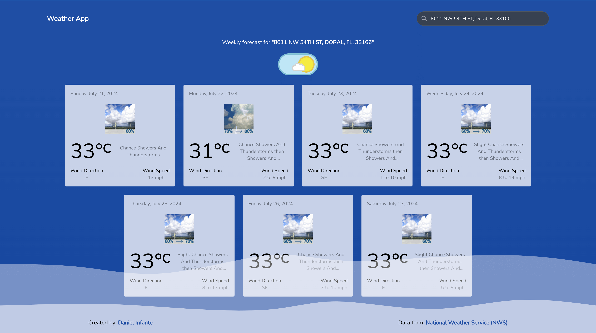

# The Weather Forecasting



With [The Weather Forecasting](https://remix-us-forecast.vercel.app/) user can search locations by address, city, state, and zip code and observe the weather for the next 7-days (day and night).

The app is developed using [React.js](https://react.dev/), [Typescript](https://www.typescriptlang.org/), and [Remix](https://remix.run/).

## 💻 Live Demo

[Remix U.S Weather Forecast](https://remix-us-forecast.vercel.app)

## ✨ Getting Started

- Make sure you already have `Node.js` and `npm` installed in your system - [lts/iron](https://nodejs.org/en/about/previous-releases#looking-for-latest-release-of-a-version-branch).
- The **`app/routes`**: It contains the code related to the [SSR](https://remix.run/docs/en/main/discussion/routes) of the application.
- The **`app/components`**: It contains the code related to the front-end of the application.
- The **`app/services`**: It contains the code related to the back-end of the application.

## ⚡ Install

- Clone the repository:

```bash
git clone https://github.com/infantito/remix-us-forecast.git
```

- Install the packages using the command `npm ci`

## 📙 Used libraries

- `react.js`
- `typescript`
- `remix`
- `tailwindcss`

Check `packages.json` for details

## ⚡️ Used services

- [US Census Geocoding](https://geocoding.geo.census.gov/geocoder/Geocoding_Services_API.pdf)
- [US National Weather](https://www.weather.gov/documentation/services-web-api)

## 🚀 Run

- Run the application using the command `npm run dev`
- Open the browser and navigate to `http://localhost:5173`

## 📄 Todos

- [ ] Unit Testing
- [ ] Celsius/Fahrenheit conversion
- [ ] Dark/Light Mode

### Whom do I talk to?

- Daniel Infante : [Peruvian dev](https://x.com/dinfantito)

### How can I appreciate this repo?

- By giving this repo a 🌟
- By Following : [@dinfantito](https://x.com/dinfantito) at Twitter

Thank You 😃
